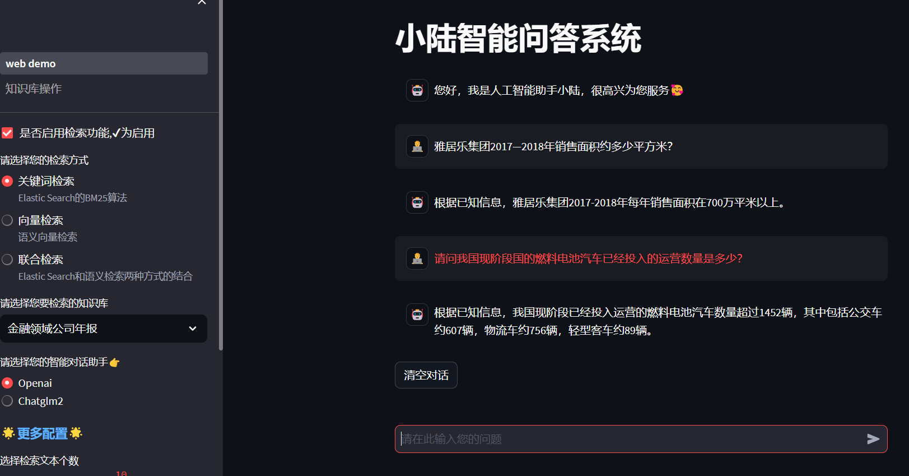

# 大模型+知识库+Langchain的智能问答系统

大致原理：

知识库文档切分------------>存入ElasticSearch&向量检索工具--------------->根据用户问题从知识库检索相关片段--------------->大模型阅读相关片段并给出答案。

- 目前只有文档切分模块和向量检索模块使用的是Langchain集成的接口。
- 支持插入和删除知识
- 支持和Openai与Chatglm2两个模型进行对话

